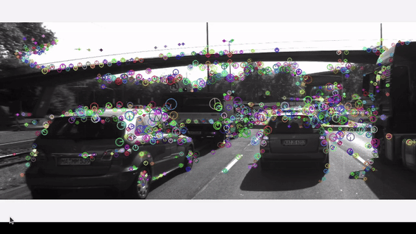

# SFND 2D Feature Tracking



The idea of the camera course is to build a collision detection system - that's the overall goal for the Final Project. As a preparation for this, you will now build the feature tracking part and test various detector / descriptor combinations to see which ones perform best. This mid-term project consists of four parts:

* First, you will focus on loading images, setting up data structures and putting everything into a ring buffer to optimize memory load. 
* Then, you will integrate several keypoint detectors such as HARRIS, FAST, BRISK and SIFT and compare them with regard to number of keypoints and speed. 
* In the next part, you will then focus on descriptor extraction and matching using brute force and also the FLANN approach we discussed in the previous lesson. 
* In the last part, once the code framework is complete, you will test the various algorithms in different combinations and compare them with regard to some performance measures. 

See the classroom instruction and code comments for more details on each of these parts. Once you are finished with this project, the keypoint matching part will be set up and you can proceed to the next lesson, where the focus is on integrating Lidar points and on object detection using deep-learning. 

[//]: # (Image References)

[image1]: ./media/ring_buffer.png "Ring Buffer"
[image2]: ./media/deque_databuffer.png "Data buffer"
[image3]: ./media/AKAZE_detector.png "Akaze"
[image4]: ./media/Brisk_detector.png "Brisk"
[image5]: ./media/Fast_detector.png "Fast"
[image6]: ./media/Harris_corner_detector.png "Harris"
[image7]: ./media/ORB_Detector.png "ORB"
[image8]: ./media/Shi_Tomasi_detector.png "ShiTomasi"
[image9]: ./media/SIFT_detector.png "SIFT"
[image10]: ./media/ORB_AND_ORB.png "ORB and ORB"
[image11]: ./media/keypointRemoval.png "Focus on car"
[image12]: ./media/FAST_and_ORB.png "FAST and ORB"
[image13]: ./media/BRISK_and_SIFT.png "BRISK and SIFT"
[image14]: ./media/ORB_and_ORB.png "ORB and ORB"
[image15]: ./media/AKAZE_AND_AKAZE.png "AKAZE and AKAZE"

## Dependencies for Running Locally
1. cmake >= 2.8
 * All OSes: [click here for installation instructions](https://cmake.org/install/)

2. make >= 4.1 (Linux, Mac), 3.81 (Windows)
 * Linux: make is installed by default on most Linux distros
 * Mac: [install Xcode command line tools to get make](https://developer.apple.com/xcode/features/)
 * Windows: [Click here for installation instructions](http://gnuwin32.sourceforge.net/packages/make.htm)

3. OpenCV >= 4.1
 * All OSes: refer to the [official instructions](https://docs.opencv.org/master/df/d65/tutorial_table_of_content_introduction.html)
 * This must be compiled from source using the `-D OPENCV_ENABLE_NONFREE=ON` cmake flag for testing the SIFT and SURF detectors. If using [homebrew](https://brew.sh/): `$> brew install --build-from-source opencv` will install required dependencies and compile opencv with the `opencv_contrib` module by default (no need to set `-DOPENCV_ENABLE_NONFREE=ON` manually). 
 * The OpenCV 4.1.0 source code can be found [here](https://github.com/opencv/opencv/tree/4.1.0)

4. gcc/g++ >= 5.4
  * Linux: gcc / g++ is installed by default on most Linux distros
  * Mac: same deal as make - [install Xcode command line tools](https://developer.apple.com/xcode/features/)
  * Windows: recommend using either [MinGW-w64](http://mingw-w64.org/doku.php/start) or [Microsoft's VCPKG, a C++ package manager](https://docs.microsoft.com/en-us/cpp/build/install-vcpkg?view=msvc-160&tabs=windows). VCPKG maintains its own binary distributions of OpenCV and many other packages. To see what packages are available, type `vcpkg search` at the command prompt. For example, once you've _VCPKG_ installed, you can install _OpenCV 4.1_ with the command:
```bash
c:\vcpkg> vcpkg install opencv4[nonfree,contrib]:x64-windows
```
Then, add *C:\vcpkg\installed\x64-windows\bin* and *C:\vcpkg\installed\x64-windows\debug\bin* to your user's _PATH_ variable. Also, set the _CMake Toolchain File_ to *c:\vcpkg\scripts\buildsystems\vcpkg.cmake*.


## Basic Build Instructions

1. Clone this repo.
2. Make a build directory in the top level directory: `mkdir build && cd build`
3. Compile: `cmake .. && make`
4. Run it: `./2D_feature_tracking`.

## Project Performance Evaluation
### MP.1 Data Buffer Optimization
For memory optimization instead of a `std::vector`, a `std::deque` is being used. 

![alt text][image1]

When an incoming images arrives and its keypoints are extracted the image is inserted in the buffer. When the buffer size is greater or equal to two we proceed with the keypoint matching. And when the buffer size is equal to max number of buffer size, then the head data will be deleted before the new data pushed into the tail of data buffer queue.

![alt text][image2]

### MP.2 Keypoint Detection
- SHITOMASI
![alt text][image8]
- HARRIS
![alt text][image6]
- FAST
![alt text][image5]
- BRISK
![alt text][image4]
- ORB
![alt text][image7]
- AKAZE
![alt text][image3]
- SIFT
![alt text][image9]

### MP.3 Keypoint Removal
Here is keypoint removal implementation
![alt text][image11]

### MP.4 Keypoint Descriptors
The following keypoint descriptors are implemented: BRISK, BRIEF, ORB, FREAK, AKAZE and SIFT. 

### MP.5 Descriptor Matching
The following matchers implemented in this project: FLANN and Brute Force. And the available selectors are: Nearest Neighbor and K-Nearest Neighbor (with the KNN being calibrated to two best matches).

### MP.6 Descriptor Distance Ratio
In the implementation the threshold values is set to 0.8

### MP.7 Performance Evaluation 1
In the table bellow we have the number of keypoints detected for the preceding vehicle for all 10 images and for all the detector types. Based on this data the three detectors that have returned the most keypoints are: AKAZE, BRISK and FAST.

Detector Type  |  Img. No. 1 |  Img. No. 2 |  Img. No. 3 |  Img. No. 4 |  Img. No. 5 |  Img. No. 6 |  Img. No. 7 |  Img. No. 8 |  Img. No. 9 |  Img. No. 10
-------------  | :---------: | :---------: | :---------: | :---------: | :---------: | :---------: | :---------: | :---------: | :---------: | :---------:
SHITOMASI      | 125         | 118         | 123         | 120         | 120         | 113         | 114         | 123         | 111         | 111
HARRIS         | 17          | 14          | 18          | 21          | 26          | 43          | 18          | 31          | 26          | 34
FAST           | 149         | 152         | 150         | 155         | 149         | 149         | 156         | 150         | 138         | 143
BRISK          | 160         | 164         | 158         | 162         | 159         | 156         | 161         | 155         | 160         | 142
ORB            | 92          | 102         | 106         | 113         | 109         | 125         | 130         | 129         | 127         | 128
AKAZE          | 166         | 157         | 161         | 155         | 163         | 164         | 173         | 175         | 177         | 179
SIFT           | 138         | 132         | 124         | 137         | 134         | 140         | 137         | 148         | 159         | 137

### MP.8 Performance Evaluation 2
In the table bellow we see the total number of matched keypoints for all 9 match instances using all possible detector-descriptor combinations. In the horizontal axis the descriptors are listed, and in the vertical the detectors.  
Descriptor/Detector Type  |     BRISK   |     BRIEF   |      ORB    |     FREAK   |     AKAZE   |  SIFT 
-------------             | :---------: | :---------: | :---------: | :---------: | :---------: | :---------: 
SHITOMASI                 | 81          | 89          | 85          | 63          | N.A.        | 68         
HARRIS                    | 13          | 16          | 16          | 13          | N.A.        | 14          
FAST                      | 87          | 98          | 96          | 71          | N.A.        | 81         
BRISK                     | 90          | 90          | 69          | 78          | N.A.        | 42         
ORB                       | 81          | 52          | 59          | 40          | N.A.        | 47         
AKAZE                     | 124         | 121         | 103         |108          | 140         | 97         
SIFT                      | 60          |  65         | N.A.        | 53          | N.A.        | 51         

### MP.9 Performance Evaluation 3
In the table bellow we see the average processing time for all detector-descriptor combination applied and averaged on all 10 input images. In the horizontal axis the descriptors are listed, and in the vertical the detectors. Based on these results we can make a proposition that the top 3 fastest detector-descriptor combinations are: FAST + BRIEF, FAST + ORB, FAST + SIFT. 

Descriptor/Detector Type  |     BRISK   |     BRIEF   |      ORB    |     FREAK   |     AKAZE   |  SIFT 
-------------             | :---------: | :---------: | :---------: | :---------: | :---------: | :---------: 
SHITOMASI                 | 44.9067     | 21.992      | 17.8674     | 34.1482     | N.A.        | 21.7399         
HARRIS                    | 39.4661     | 15.5394     | 18.4634     | 34.9929     | N.A.        | 21.5843         
FAST                      | 26.8315     | 2.95946     | 5.83626     | 23.9629     | N.A.        | 14.1271         
BRISK                     | 65.4532     | 43.3297     | 57.4566     | 61.351      | N.A.        | 62.7616         
ORB                       | 45.7163     | 23.4924     | 38.2593     | 41.8519     | N.A.        | 52.4007        
AKAZE                     | 81.7695     | 59.1585     | 65.3632     | 75.1802     | 96.4652     | 67.0839         
SIFT                      | 96.7775     | 72.9121     | N.A.        | 90.2254     | N.A.        | 117.035     